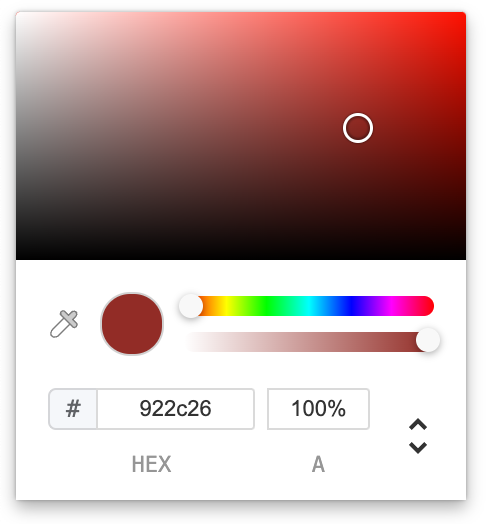

# vue3-color-picker

> 基于Typescript + Vue3 实现的一个颜色选择器




## 怎么使用?
1. 安装
```shell
bun add @miharakinu/vue3-color-picker
```
or
```shell
yarn add @miharakinu/vue3-color-picker
```

2. 全局使用
```js
import { createApp } from 'vue'
import App from './App.vue'
const app = createApp(App);

import { ColorPicker } from '@miharakinu/vue3-color-picker';
app.use(ColorPicker);
app.mount('#app');
```

然后在模板中：

```vue
<ColorPicker v-model="color" />
```

3. 按需使用
```html
<script setup>
import { ref } from 'vue';
import { ColorPicker } from '@miharakinu/vue3-color-picker';
const color = ref('#FFFFFF');
</script>
<template>
    <div>
        <ColorPicker v-model="color"/>
    </div>
</template>
```